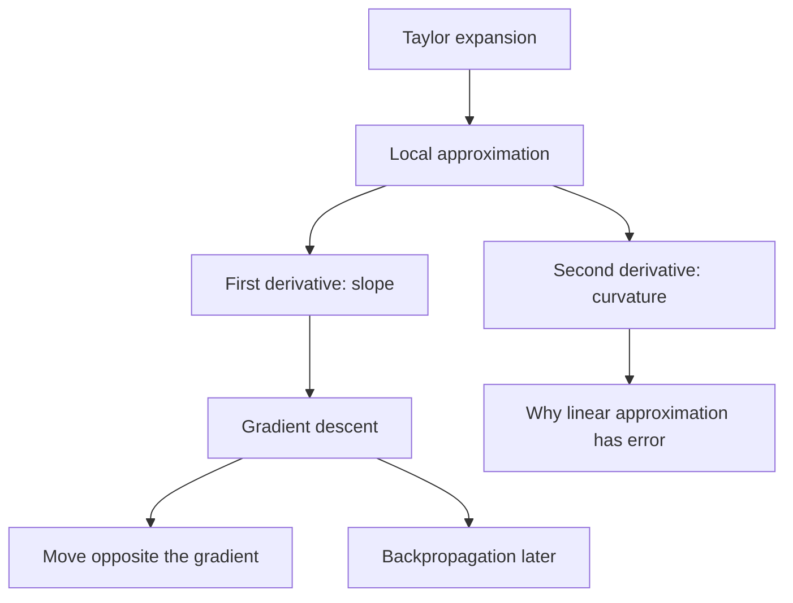

# Book Study: Linear Algebra and Learning from Data

Date: 2026-07-04
Updated: 2026-07-05
Book: *Linear Algebra and Learning from Data* by Gilbert Strang
Main session focus: Taylor expansion as the bridge from calculus to gradient descent.
Secondary context: SVD intuition, singular vectors, book roadmap, and where neural-network gradient descent appears in the book.

## Pages And Sections Mentioned

| Topic | Book section from table of contents | Page noted in session |
| --- | --- | --- |
| Gradient descent | VI.4 Gradient Descent Toward the Minimum | p. 344 |
| SGD and ADAM | VI.5 Stochastic Gradient Descent and ADAM | p. 359 |
| Neural networks | VII.1 The Construction of Deep Neural Networks | p. 375 |
| Backpropagation | VII.3 Backpropagation and the Chain Rule | p. 397 |
| Singular values and singular vectors | I.8 Singular Values and Singular Vectors in the SVD | Part I, exact page not confirmed in this note |
| PCA and low-rank approximation | I.9 Principal Components and the Best Low Rank Matrix | Part I, exact page not confirmed in this note |

## Concept Map

## 1. What We Mainly Studied Today

The main topic was Taylor expansion.

The reason we studied it was not just to learn a calculus formula. We studied it because Taylor expansion explains why gradient descent can use local information, such as slope or gradient, to decide how to move toward a minimum.

The core idea:

> Taylor expansion approximates a complicated function near a known point using the function value, slope, curvature, and higher derivatives at that point.

This became the missing bridge between calculus and optimization.

## 2. First-Order Taylor Expansion

For a one-variable function, the first-order Taylor approximation around \(a\) is:

\[
f(x) \approx f(a) + f'(a)(x-a)
\]

Meaning:

- \(f(a)\) gives the known height of the function at \(a\).
- \(f'(a)\) gives the slope at \(a\).
- \((x-a)\) tells how far we moved away from \(a\).

So first-order Taylor expansion is the best local line that matches the function's value and slope at \(a\).

In plain language:

> Near a point, a smooth curve can be approximated by its tangent line.

## 3. Example: Approximating \(x^2\) Near 2

We used:

\[
f(x)=x^2, \qquad a=2
\]

First compute the value:

\[
f(2)=4
\]

Then compute the derivative:

\[
f'(x)=2x, \qquad f'(2)=4
\]

Substitute into the first-order Taylor formula:

\[
f(x) \approx f(2) + f'(2)(x-2)
\]

So:

\[
x^2 \approx 4 + 4(x-2)
\]

or:

\[
x^2 \approx 4x - 4
\]

Testing at \(x=2.1\):

| Quantity | Value |
| --- | --- |
| Exact value | \((2.1)^2 = 4.41\) |
| Taylor approximation | \(4(2.1)-4 = 4.4\) |
| Error | \(0.01\) |

The approximation was close because \(2.1\) is near \(2\).

## 4. Why The First-Order Approximation Has Error

The first-order approximation only matches:

- the function value,
- the slope.

It does not match the curvature.

For \(f(x)=x^2\), the graph bends upward. A tangent line cannot fully capture that bending, so the approximation has a small error when we move away from the expansion point.

This led to the next question:

> What mathematical quantity measures curvature?

Answer:

\[
f''(x)
\]

The second derivative measures how the slope changes.

## 5. Second-Order Taylor Expansion

To include curvature, we add a second-order term:

\[
f(x)
\approx
f(a) + f'(a)(x-a) + \frac{f''(a)}{2!}(x-a)^2
\]

Interpretation:

| Term | Meaning |
| --- | --- |
| \(f(a)\) | Current value |
| \(f'(a)(x-a)\) | Linear change from slope |
| \(\frac{f''(a)}{2!}(x-a)^2\) | Curvature correction |

For \(f(x)=x^2\):

\[
f''(x)=2
\]

So the second-order Taylor approximation around \(a=2\) becomes:

\[
x^2
\approx
4 + 4(x-2) + \frac{2}{2!}(x-2)^2
\]

Since \(2! = 2\), this simplifies to:

\[
x^2
\approx
4 + 4(x-2) + (x-2)^2
\]

For a quadratic function like \(x^2\), the second-order Taylor expansion is exact, because there are no third-order or higher terms.

## 6. Why Taylor Expansion Matters For Gradient Descent

Gradient descent asks:

> If I am at the current point, which nearby direction makes the function decrease?

Taylor expansion gives the local answer.

In one dimension:

\[
f(x+h) \approx f(x) + f'(x)h
\]

If we want \(f(x+h)\) to be smaller than \(f(x)\), then we want:

\[
f'(x)h < 0
\]

That means \(h\) should point opposite the sign of \(f'(x)\).

So the gradient descent update becomes:

\[
x_{k+1} = x_k - \eta f'(x_k)
\]

where \(\eta\) is the learning rate.

This was the key conceptual link:

> Taylor expansion predicts local change; gradient descent chooses the local change that decreases the function.

## 7. Multivariable Version

For a function of several variables, the first-order Taylor approximation becomes:

\[
f(x+\Delta x)
\approx
f(x) + \nabla f(x)^T \Delta x
\]

If we move a small amount in a unit direction \(u\):

\[
\Delta x = \varepsilon u
\]

then:

\[
f(x+\varepsilon u)
\approx
f(x) + \varepsilon \nabla f(x)^T u
\]

The direction-dependent part is:

\[
\nabla f(x)^T u
\]

This dot product explains why the gradient is the direction of steepest ascent, and why the negative gradient is the direction of steepest descent.

## 8. Gradient Descent: What We Derived

For one variable, if we want to minimize \(f(x)\), the derivative \(f'(x)\) tells us which direction is uphill.

Therefore, to go downhill, we move in the opposite direction:

\[
x_{k+1} = x_k - \eta f'(x_k)
\]

Important interpretation:

- Sign of derivative: tells direction.
- Magnitude of derivative: tells steepness.
- Learning rate: controls step size.

If the learning rate is too large, gradient descent may overshoot the minimum repeatedly and fail to settle.

## 9. SVD Context From The Same Study Session

We also reviewed SVD intuition, though this was secondary to Taylor expansion today.

For SVD, the key relation is:

\[
Av_i = \sigma_i u_i
\]

Meaning:

- \(v_i\) is a right singular vector: a special input direction.
- \(u_i\) is a left singular vector: the corresponding output direction.
- \(\sigma_i\) is the singular value: how much the matrix stretches that input direction.

Both \(u_i\) and \(v_i\) are unit vectors by convention:

\[
\|u_i\| = 1, \qquad \|v_i\| = 1
\]

This makes the singular value meaningful:

\[
\sigma_i = \|Av_i\|
\]

A unit vector does not have to be a standard basis vector like \((1,0,0)\). It can point in a rotated direction, as long as its norm is 1.

## 10. Book Roadmap Notes

We clarified that *Linear Algebra and Learning from Data* is not only a linear algebra book. It uses linear algebra as the foundation for data science and machine learning.

The broad structure includes:

| Part | Theme |
| --- | --- |
| I | Highlights of Linear Algebra |
| II | Computations with Large Matrices |
| III | Low Rank and Compressed Sensing |
| IV | Special Matrices |
| V | Probability and Statistics |
| VI | Optimization |
| VII | Learning from Data |

For neural-network gradient descent, the important sections are:

- VI.4 Gradient Descent Toward the Minimum, p. 344
- VI.5 Stochastic Gradient Descent and ADAM, p. 359
- VII.1 The Construction of Deep Neural Networks, p. 375
- VII.3 Backpropagation and the Chain Rule, p. 397

The most important section for deriving neural-network gradients is VII.3, because it connects backpropagation to the chain rule and reverse-mode differentiation.

## 11. Main Takeaways

- Taylor expansion was the central topic of today's study.
- First-order Taylor expansion approximates a function locally by its tangent line.
- The derivative gives the slope, which predicts local change.
- Second-order Taylor expansion adds curvature through the second derivative.
- Gradient descent is motivated by first-order Taylor expansion: choose a step that makes the local approximation decrease.
- In many dimensions, the dot product \(\nabla f(x)^T u\) explains directional derivatives and steepest descent.
- SVD remained useful context, but today's main conceptual bridge was calculus to optimization.

## Next Study Thread

Continue from the multivariable Taylor expansion and directional derivative:

1. Why \(\nabla f\) is steepest ascent.
2. Why \(-\nabla f\) is steepest descent.
3. How the learning rate \(\eta\) interacts with curvature.
4. Why second-order information leads toward Newton's method.
5. How backpropagation computes gradients efficiently for neural networks.
