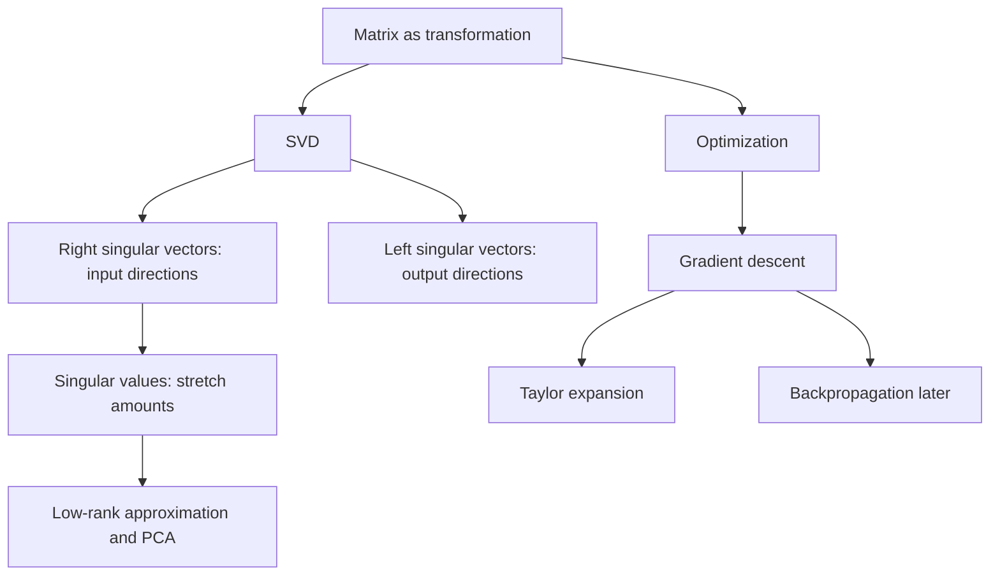

# Book Study: Linear Algebra and Learning from Data

Date: 2026-07-04
Book: *Linear Algebra and Learning from Data* by Gilbert Strang
Session focus: SVD intuition, singular vectors, book roadmap, and the start of gradient descent through Taylor expansion.

## Pages And Sections Mentioned

| Topic | Book section from table of contents | Page noted in session |
| --- | --- | --- |
| Singular values and singular vectors | I.8 Singular Values and Singular Vectors in the SVD | Part I, exact page not confirmed in this note |
| PCA and low-rank approximation | I.9 Principal Components and the Best Low Rank Matrix | Part I, exact page not confirmed in this note |
| Gradient descent | VI.4 Gradient Descent Toward the Minimum | p. 344 |
| SGD and ADAM | VI.5 Stochastic Gradient Descent and ADAM | p. 359 |
| Neural networks | VII.1 The Construction of Deep Neural Networks | p. 375 |
| Backpropagation | VII.3 Backpropagation and the Chain Rule | p. 397 |

## Concept Map

## 1. What A Singular Vector Means

A matrix can be understood as a machine that transforms input vectors into output vectors. Most input directions get mixed: the output may change direction and length in a complicated way.

A singular vector is a special direction that the matrix treats cleanly.

For SVD, the key relation is:

\[
Av_i = \sigma_i u_i
\]

Meaning:

- \(v_i\) is a right singular vector: a special input direction.
- \(u_i\) is a left singular vector: the corresponding output direction.
- \(\sigma_i\) is the singular value: how much the matrix stretches that input direction.

The word "right" comes from the SVD formula:

\[
A = U \Sigma V^T
\]

Columns of \(V\) are right singular vectors. Columns of \(U\) are left singular vectors.

## 2. Why Singular Vectors Are Unit Vectors

Both \(u_i\) and \(v_i\) are unit vectors by convention:

\[
\|u_i\| = 1, \qquad \|v_i\| = 1
\]

This matters because otherwise the stretch factor would be ambiguous. If we allowed arbitrary vector lengths, we could rescale \(u\) or \(v\) and change the apparent value of \(\sigma\) without changing the matrix.

With unit vectors, the singular value has a clean physical meaning:

\[
\sigma_i = \|Av_i\|
\]

So \(\sigma_i\) is literally the output length when the input is a unit right singular vector.

## 3. Unit Vector Does Not Mean Standard Basis Vector

A unit vector does not have to look like:

\[
(1,0,0), \quad (0,1,0), \quad (0,0,1)
\]

It only needs length 1. For example:

\[
\frac{1}{\sqrt{2}}
\begin{bmatrix}
1 \\
1
\end{bmatrix}
\]

is also a unit vector.

Singular vectors often point in rotated directions. They are the directions where the matrix naturally stretches most cleanly. SVD is partly about discovering the coordinate system where the matrix becomes simple.

## 4. SVD As Three Physical Operations

The SVD formula:

\[
A = U\Sigma V^T
\]

can be interpreted physically as three operations:

1. Rotate or re-express the input space with \(V^T\).
2. Stretch along clean coordinate directions with \(\Sigma\).
3. Rotate or place the result into the output space with \(U\).

This makes SVD feel less like a formula to memorize and more like a decomposition of what a matrix does geometrically.

## 5. What Kind Of Book This Is

We clarified that *Linear Algebra and Learning from Data* is not only a linear algebra book. It uses linear algebra as the foundation for data science and machine learning.

The broad structure includes:

| Part | Theme |
| --- | --- |
| I | Highlights of Linear Algebra |
| II | Computations with Large Matrices |
| III | Low Rank and Compressed Sensing |
| IV | Special Matrices |
| V | Probability and Statistics |
| VI | Optimization |
| VII | Learning from Data |

The book connects linear algebra to PCA, low-rank approximation, optimization, neural networks, and backpropagation.

## 6. LSTMs, Transformers, And Differential Equations

We checked the book's scope conceptually:

- It does not appear to focus on LSTMs or Transformers.
- It focuses more on the mathematical foundations behind machine learning.
- It includes some differential-equation-related ideas, especially through PDEs, finite differences, graph Laplacians, and adjoint/backpropagation analogies.
- It is not a full differential equations textbook.

The useful takeaway: this book is a strong prerequisite for modern neural network topics, even if it does not directly teach Transformer architecture.

## 7. Where Gradient Descent And Backpropagation Appear

For neural network gradient descent, the important sections are:

- VI.4 Gradient Descent Toward the Minimum, p. 344
- VI.5 Stochastic Gradient Descent and ADAM, p. 359
- VII.1 The Construction of Deep Neural Networks, p. 375
- VII.3 Backpropagation and the Chain Rule, p. 397

The most important section for deriving neural-network gradients is VII.3, because it connects backpropagation to the chain rule and reverse-mode differentiation.

## 8. Gradient Descent: What We Derived

We began studying "Gradient Descent Toward the Minimum" Socratically.

For one variable, if we want to minimize \(f(x)\), the derivative \(f'(x)\) tells us which direction is uphill.

Therefore, to go downhill, we move in the opposite direction:

\[
x_{k+1} = x_k - \eta f'(x_k)
\]

where:

- \(x_k\) is the current point.
- \(x_{k+1}\) is the next point.
- \(\eta\) is the learning rate.
- \(f'(x_k)\) is the slope at the current point.

Important interpretation:

- Sign of derivative: tells direction.
- Magnitude of derivative: tells steepness.
- Learning rate: controls step size.

If the learning rate is too large, gradient descent may overshoot the minimum repeatedly and fail to settle.

## 9. Why The Gradient Is The Steepest Direction

We started moving from one-dimensional derivatives to multivariable gradients.

For a function \(f(x,y)\), the gradient is:

\[
\nabla f =
\begin{bmatrix}
\frac{\partial f}{\partial x} \\
\frac{\partial f}{\partial y}
\end{bmatrix}
\]

The key idea we were building toward:

If we move a small amount in a unit direction \(u\), the first-order change in the function is controlled by:

\[
\nabla f(x)^T u
\]

This dot product is largest when \(u\) points in the same direction as \(\nabla f(x)\). Therefore, the gradient is the direction of steepest ascent, and the negative gradient is the direction of steepest descent.

## 10. Taylor Expansion: The Missing Bridge

We paused gradient descent to learn Taylor expansion, because it explains why local slope information is enough to guide optimization.

First-order Taylor approximation:

\[
f(x) \approx f(a) + f'(a)(x-a)
\]

This means: near \(a\), approximate the function by the line with the same value and slope at \(a\).

Example studied:

\[
f(x)=x^2, \qquad a=2
\]

Then:

\[
f(2)=4, \qquad f'(2)=4
\]

So:

\[
x^2 \approx 4 + 4(x-2) = 4x - 4
\]

Testing at \(x=2.1\):

- Exact: \((2.1)^2 = 4.41\)
- Taylor approximation: \(4(2.1)-4 = 4.4\)

The approximation is close because \(2.1\) is near \(2\). The error exists because the linear approximation ignores curvature.

Second-order Taylor approximation adds curvature:

\[
f(x)
\approx
f(a) + f'(a)(x-a) + \frac{f''(a)}{2!}(x-a)^2
\]

For \(f(x)=x^2\), the second derivative is:

\[
f''(x)=2
\]

This captures why the curve bends.

## 11. Main Takeaways

- A matrix is best understood as a transformation, not just a grid of numbers.
- SVD finds special input directions \(v_i\), output directions \(u_i\), and stretch amounts \(\sigma_i\).
- Singular vectors are unit vectors, but not necessarily standard basis vectors.
- SVD decomposes a matrix into rotation, stretching, and rotation.
- The book connects linear algebra to optimization, statistics, and neural networks.
- Gradient descent comes from the simple idea: move opposite the derivative or gradient.
- Taylor expansion explains why local derivative information predicts local change.

## Next Study Thread

Continue from second-order Taylor expansion, then return to:

1. Directional derivatives.
2. Why \(\nabla f\) is steepest ascent.
3. Why \(-\nabla f\) is steepest descent.
4. How this becomes gradient descent in many dimensions.
5. How backpropagation computes gradients efficiently for neural networks.
